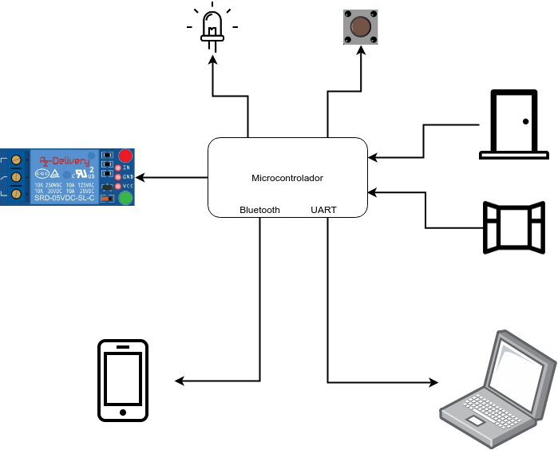
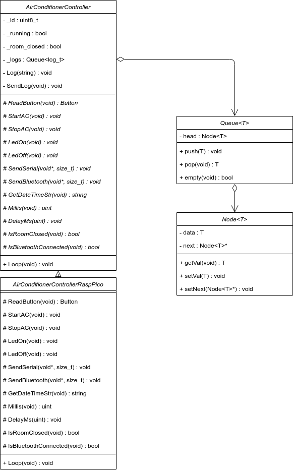
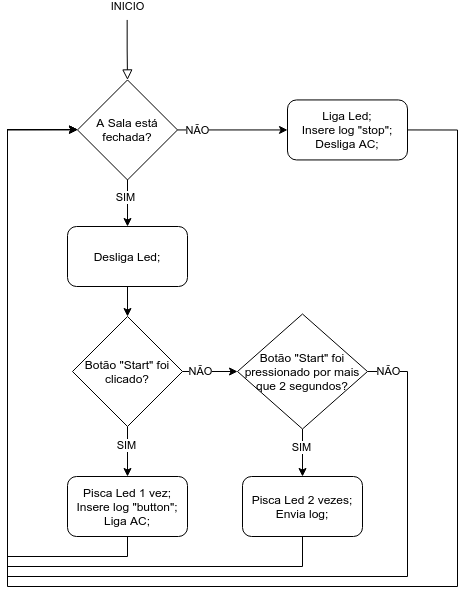

# AirConditionerController

**Autor**: Cleisson Fernandes da Silva

**Repositório**: https://github.com/cleissom/AirConditionerController


## Requisitos

Um sistema para diminuir o consumo de energia elétrica e aumentar a vida útil de aparelhos de ar-condicionado.

**Funcionais**:

* Deve possuir um botão para restabelecer a energia;
* Deve indicar para o usuário quando o sistema está atuando;
* Deve criar um Log dos eventos ocorridos;
* Deve ser possível enviar os logs gerados para um computador ou smartphone;

**Não Funcionais**:

* O produto precisa ter um custo máximo de R$70,00;
* O consumo máximo deve ser de 150 mA/h;
* As dimensões deve ser no máximo de 15cm X 20cm X 10cm (c x l x a);

## Especificações

O sistema proposto será utilizado para evitar o gasto de energia elétrica com aparelhos de ar-condicionado que permanecem ligados sem usuários no recinto. Sempre que alguma porta ou janela for aberta no recinto onde se encontra o aparelho de ar-condicionado, o microcontrolador deverá interromper o fornecimento de energia para o ar-condicionado. 

Quando isso ocorrer, um LED vermelho poderá permanecer aceso até que todas as aberturas (portas e janelas) tenham sido fechadas. Após isso, o LED vermelho deverá ser apagado. Quando o LED vermelho estiver apagado, então a energia para o arcondicionado poderá ser restabelecida ao se pressionar um botão conectado ao microcontrolador. A partir desse instante, o usuário poderá voltar a utilizar o controle remoto do ar-condicionado normalmente. 

O sistema deverá manter os logs de eventos ocorridos além de ser possível a transferência destes logs para um computador ou smartphone hospedeiro.

## Arquitetura

### Hardware

Deverá ser utilizado o hardware representado no diagrama da Figura 1. Este hardware é composto por:

* Microcontrolador Raspberry Pi RP2040 (Kit Raspberry Pi Pico)
* LED
* Botão
* Sensor de abertura para porta/janela (Ex.: Reed Switch)
* Relé

Visando a redução do sistema, será utilizado apenas um botão para executar as funções de ligar o sistema do ar-condicionado e envio de logs para um hospedeiro. Além disso, é possível indicar para o usuário a execução das funções através de um piscar do LED com padrões diferentes.



<p align="center">Figura 1: Circuito a ser implementado</p>


### Software

O software deverá ser escrito na linguagem C++, sem a utilização de um sistema operacional. Deverão ser utilizados os conceitos de programação orientada a objetos, principalmente o uso de polimorfismo com classes abstratas visando a portabilidade do código para diversos fabricantes de microcontroladores e aquecedores de piscinas.

Para programar o Microcontrolador Raspberry Pi RP2040 será utilizado a Raspberry Pi Pico C/C++ SDK.

É possível adicionar quantos sensores de porta/janela forem necessários. Apenas sendo necessário adicionar a leitura do sensor na função `IsRoomClosed()` da classe correspondente.

O botão disponível para o usuário do sistema pode executar mais que uma ação, de acordo com os seguintes critérios:

* **clique simples**: clicar no botão;
* **clique longo**: segurar o botão pressionado por mais que 2 segundos;

Estas ações executam as seguintes funções:

* **clique simples**: restabelece a energia caso todas as portas/janelas estejam fechadas;
* **clique longo**: envia os logs gerados para um hospedeiro;

#### Log

O dispositivo deverá contar com um sistema de logging para monitoramento de eventos. Estes logs deverão ser enviados à um computador ou smartphone hospedeiro para uma posterior análise dos dados. O dispositivo deve enviar os dados através do bluetooth mesmo estiver conectado a um hospedeiro, caso contrário deverá enviar para a serial.

Um log será gerado na ocorrência dos seguintes eventos:

* O ar-condicionado foi desligado devido à abertura de porta ou janela;
* Botão de acionamento foi pressionado, quando o sistema estava sem energia; 

Para o envio do log para o computador hospedeiro é necessário:

1. Conectar o sistema ao mesmo através de uma conexão serial (USART);
2. Executar a aplicação do hospedeiro e selecionar a opção de leitura de dados;
3. Executar a função de envio dos logs no dispositivo;

Para o envio do log para um smartphone hospedeiro é necessário:

1. Conectar o sistema ao mesmo através de uma conexão bluetooth;
2. Executar o aplicativo do hospedeiro e selecionar a opção de leitura de dados;
3. Executar a função de envio dos logs no dispositivo;

#### Compilação (Linux)

Para compilar a aplicação é necessário:

1. instalar o Raspberry Pi Pico C/C++ SDK;

2. Setar a variável de ambiente PICO_SDK_PATH para o diretório de instalação da SDK.

3. Executar os seguintes comandos no diretório `src/`:

   ```
   mkdir build
   cd build
   cmake ..
   make
   ```

4. copiar o arquivo compilado `main.uf2` para a unidade removível onde o se encontra o Raspberry Pi Pico.


### Software Hospedeiro Computador

O Software Hospedeiro é um programa executado em um computador que deverá ser conectado à um dispositivo de controle através da serial e então poder realizar a transferência para receber os logs gerados.

Este software apresenta um menu por terminal em que é possível selecionar:

* 1: Para entrar em modo "escuta" e aguardar o envio dos logs de um dispositivo conectado;
* 2: Listar todos os logs recebidos e presentes no programa;

Para compilar este software executar o seguinte comando no diretório `src/hospedeiro-computador`:

```
g++ Serial.cpp -o serial
```

A compilação irá gerar o arquivo `serial` que deverá ser executado por terminal.

### Software Hospedeiro Smartphone

O Software Hospedeiro Smartphone é um aplicativo para Android que deverá se conectar com um dispositivo de controle por Bluetooth e então poder realizar a transferência para receber os logs gerados.

Este software apresenta uma tela com botões onde é possível:

* **Carregar**: Este botão se conecta com o dispositivo e recebe os logs
* **Listar:** Este botão lista todos os logs recebidos e que estão presentes no aplicativo. Os items são mostrados logo abaixo deste botão.

Para compilar este software é nessário instalar o software Android Studio e sua toolchain de compilação para Android. Adicione o projeto que está presente na pasta `src/hospedeiro_smartphone` ao Android Studio e então é possível compilar o projeto dentro do programa.

*Obs*.: A interface chama as funções em C++ presentes na pasta `src/hospedeiro_smartphone/app/src/main/cpp/`


## Componentes

O diagrama de classes do software do microcontrolador pode ser visualizado na Figura 2:



<p align="center">Figura 2: Diagrama de Classes</p>


Um diagrama de fluxo simplificado da execução do programa no microcontrolador pode ser visualizado na Figura 3:



<p align="center">Figura 3: Diagrama de Fluxo</p>


## Integração

Um vídeo demonstração do protótipo implementado pode ser visualizado no link abaixo:

https://youtu.be/1VUw7NChK6c

## Plano de testes

### Teste de Violação

Este teste irá verificar os casos em que o usuário não segue o fluxo estabelecido.

* **Abrir uma porta/janela, fechar e abrir novamente**: A lógica implementada independe do número de vezes em que as portas/janelas são abertas/fechadas
* **Clique longo para enviar log enquanto uma porta/janela estiver aberta**: O log poderá ser enviado apenas quando todas as portas/janelas estiverem fechadas.

### Teste de Memória

Foi realizado um teste de memória em que a lista de logs foi incrementada com novos dados em um loop infinito após a inicialização do sistema. Foi possível adicionar cerca de 4320 itens de log até chegar ao erro de falta de memória.

## Desempenho

### Memória Flash

O microcontrolador escolhido possui 2MB de Flash QSPI on-board. O binário compilado possui o tamando de 311,3 KB e portanto ocupa cerca de 15% da memória Flash total.

### Memória SRAM

O microcontrolador escolhido possui 264KB de memória SRAM *on-chip*. Com o teste de memória realizado anteriormente é possível deduzir a quantidade de memória que está sendo utilizada e a quantidade disponível para alocação dinâmica. Como a estrutura para log é formada por um identificador de 1 byte e duas strings de 20 bytes, o tamanho deste dado completo é 41 bytes. O Nodo da lista tem o tamanho do dado mais 4 bytes para o ponteiro para o próximo dado, resultando:

4320 * 45 = 194,4 KB

Portanto, há disponível cerca de 194,4 KB para a alocação dinâmica e consequentemente a aplicação utiliza cerca 69.6 KB da memória SRAM total (valor incluindo *stack*).
